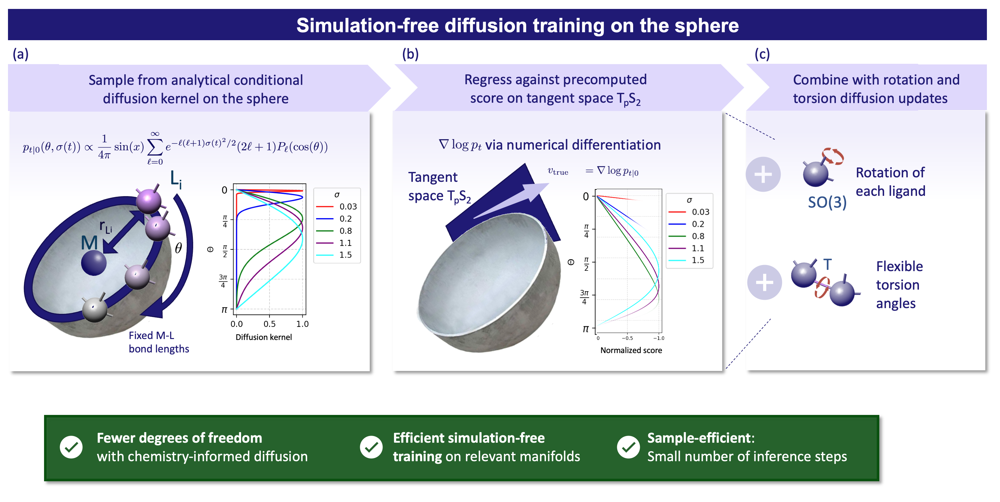

# TMCgen: Manifold Diffusion for Structure Generation of Transition Metal Complexes

TMCgen is a manifold diffusion model for generating accurate three-dimensional geometries of transition metal complexes. By operating directly on coordination angles, ligand rotations, and torsions, it captures the key geometric degrees of freedom while remaining computationally efficient. 



## Installation

### Environment

```bash
conda env create -f env.yml
conda activate tmcgen
pip install -e .
```
### Precompute manifold heat kernels
Download them from Zenodo ([10.5281/zenodo.20072262](https://doi.org/10.5281/zenodo.20072262)) or precompute them yourself with:
```bash
python tmcgen/utils/n_sphere_angle.py
python tmcgen/utils/so3.py
python tmcgen/utils/torus.py
```

## Datasets
Download the processed data from Zenodo ([10.5281/zenodo.20072262](https://doi.org/10.5281/zenodo.20072262)) and unpack into `data/processed/`. Dataset splits are located in `data/raw/tmqmg/`.

## Training
Train the model:
```bash
python scripts/run/score.py --config configs/train/config_train.yml
```
Adapt the data_dir inside the config file to your setup.

## Inference
To run inference with the model:
```bash
python scripts/run/score.py --config configs/inference/inference_chem_examples.yml
```

## License

MIT License (see LICENSE file).

## Reference

```bibtex
@article{schaufelberger2026transitionmetal,
  title   = {Manifold Diffusion for Structure Generation of Transition Metal Complexes},
  author  = {Schaufelberger, Luca and Jorner, Kjell},
  year    = {2026},
}
```

## Acknowledgements
This code builds on [Dockgame](https://arxiv.org/abs/2310.06177), [Torsional Diffusion](https://github.com/gcorso/torsional-diffusion) and [DiffDock](https://github.com/gcorso/DiffDock/tree/main). Refer to THIRD_PARTY_LICENCES.txt for comprehensive licensing details. This publication was created as part of NCCR Catalysis (grant numbers 180544 and 225147), a National Centre of Competence in Research funded by the Swiss National Science Foundation.
